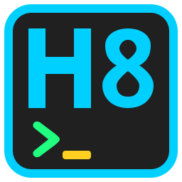

<div align="center">
	
	<h1>H8 Launcher</h1>
</div>
<div align="center">
	<a href="matrix:r/H8-Launcher:matrix.org?action=join"></a>
	&emsp;
	<a href="https://t.me/H8_Launcher"></a>
	&emsp;
	<!--<a href="#"></a>-->
</div>

<br />

__H8 Launcher__ is a lightweight Perl-based command launcher that lets you define and run custom shell commands using simple aliases configured in a YAML file. It supports custom variables, command descriptions, and execution context options, providing a convenient way to organize and quickly access frequently used terminal commands.

### 🧭 Navigate the Launcher
- [Compatibility](#-compatibility)
- [Features](#-features)
- [Requirements](#-requirements)
- [Installation](#-installation)
	- [Linux / MacOS](#linux--macos)
	- [Windows](#windows)
- [Usage](#-usage)
	- [Internal Commands](#internal-commands)
	- [Edit Configuration File](#edit-configuration-file)
	- [Define Global Variables](#define-global-variables)
	- [Set Environment Variables](#set-environment-variables)
	- [Define Aliases](#define-aliases)
	- [Run Commands](#run-commands)
	- [View Available Commands](#view-available-commands)
- [License](#-license)


## 🧩 Compatibility

__H8 Launcher__ is designed to run on:
- Linux / MacOS
- Windows

> Note: __H8 Launcher__ requires [Perl](https://www.perl.org/) to be installed and available in your system `PATH`.


### Install Perl 5.x

- On __Linux__ / __MacOS__: Already Installed
- On __Windows__: [Strawberry Perl](https://strawberryperl.com/)


## ✨ Features

- __Command Aliases__ — Define custom shell commands and run them with short, memorable aliases.
- __YAML Configuration__ — Manage your commands and settings in a simple YAML file.
- __Custom Variables__ — Define reusable variables and use them in your commands.
- __Command Descriptions__ — Add descriptions that are displayed in the usage screen.
- __Execution Metadata__ — Customize the execution context of individual commands.
- __Zero-configuration Setup__ — Automatically creates the configuration file on first run.
- __Fast Command Execution__ — Run any configured command directly with `run <alias>`.


## 🛠️ Requirements

- Perl 5.x
- No external Perl modules are required.


## 📥 Installation

__H8 Launcher__ is easy to install with simple and straightforward installation steps.


### Linux / MacOS


#### 1. Clone The Repository
```sh
git clone https://github.com/H8WebDev/Launcher.git
cd Launcher
```
Alternatively, you can download the repository as a ZIP file and extract it.


#### 2. Run The Installation Script:
```sh
chmod a+x install.sh
./install.sh
```
The installer will:
- Checks that Perl is installed.
- Makes the `run.pl` script executable.
- Creates `~/.local/bin` if it does not exist.
- Creates a symbolic link from `~/.local/bin/run` to the __H8 Launcher__ `run.pl` script.
- Checks whether `~/.local/bin` is available in your `PATH`.

After installation, restart your terminal if necessary and run:
```sh
run
```
You should see the usage screen with a demo alias.


### Windows


#### 1. Clone The Repository
```sh
git clone https://github.com/H8WebDev/Launcher.git
cd Launcher
```
Alternatively, download the repository as a ZIP file and extract it.


#### 2. Run The __PowerShell__ Installation Script:
```sh
.\install.ps1
```

The installer will:
- Checks that Perl is installed.
- Adds the __H8 Launcher__ directory to your user `PATH`.
- Makes the `run.cmd` wrapper available as the `run` command.

After installation, __restart your terminal__ so that the updated `PATH` takes effect.

You can then run __H8 Launcher__ from any directory:
```sh
run
```


## 🚀 Usage

After installation, run __H8 Launcher__ from any directory:
```sh
run
```

On the first run, __H8 Launcher__ creates a configuration file in your home directory:
```
~/.launcher-commands.yaml
```

It then displays the usage screen with the available command aliases.


### Internal Commands

__H8 Launcher__ provides a set of built-in commands for performing launcher-specific operations and managing its configuration.
Unlike regular aliases, internal commands are prefixed with `@` and are executed directly by __H8 Launcher__.

The general syntax for executing an internal command is:
```sh
run @<command>
```

For example:
```sh
run @edit
```

The available internal commands and their usage are documented below.


#### @clear

The `@clear` command clears the current terminal screen, removing all previously displayed output from the terminal.

Usage:
```sh
run @clear
```
After execution, the terminal is cleared and ready for new output.


#### @dump

The `@dump` command displays a complete dump of all commands defined in the `~/.launcher-commands.yaml` configuration file.

The dump includes each command's alias along with its associated properties, such as `cmd`, `desc`, and `meta`.

Usage:
```sh
run @dump
```
The output provides a complete overview of the commands currently available to __H8 Launcher__. Details about the individual properties are covered in the following sections.


#### @edit

The `@edit` command opens the `~/.launcher-commands.yaml` configuration file in the `nano` text editor, allowing you to view and modify your registered commands and aliases.

Usage:
```sh
run @edit
```
By default, `nano` is used as the text editor. To use a different editor, edit the `run.pl` file and modify the `TEXT_EDITOR` constant.


#### @env

The `@env` command displays a dump of all environment variables currently defined for __H8 Launcher__. This can be useful for inspecting the environment available to the launcher and verifying the values of its configured variables.

Usage:
```sh
run @env
```


#### @repo

The `@repo` command opens the __H8 Launcher__ project repository on [GitHub](https://github.com/H8WebDev/Launcher) using the system's default web browser.

Usage:
```sh
run @repo
```
When executed, the project's GitHub repository is opened in the default browser.


#### @vars

The `@vars` command displays a dump of all global variables defined in the __H8 Launcher__ configuration file.

Usage:
```sh
run @vars
```
This provides an overview of the global variables currently available to the launcher.


### Edit Configuration File

Commands are defined as aliases in `~/.launcher-commands.yaml`.

__H8 Launcher__ provides the `@edit` command to quickly open the configuration file with `nano`:
```sh
run @edit
```
This opens `~/.launcher-commands.yaml` with `nano` text editor.
You can use this command whenever you want to add, modify, or remove commands.


### Define Global Variables

__H8 Launcher__ supports defining global variables directly in the configuration file. These variables can be referenced from command definitions and metadata, allowing values to be defined once and reused across multiple commands.


#### Definition

Global variables are defined as root-level keys whose names start with `$`:
```yaml
$my-var: any value
```
Any root-level key beginning with `$` is treated as a global variable.

The value of a global variable can be any supported YAML value, including strings, numbers, lists, maps, and nested structures.


#### Using Global Variables

Global variables can be referenced in the `cmd` and `meta` properties of commands using their variable name.

For example:
```yaml
$my-var:
  nested-key:
    - first-value
    - second-value
$my-env-var: any value

my-alias:
  cmd: clear; echo "${my-var[nested-key][1]}" # output: second-value
  meta:
    ^MY_ENV: ${my-env-var}
```
Variables support nested access, allowing individual values to be referenced from complex lists and maps.


#### Overriding Variables

Global variables can be overridden at runtime using CLI arguments. This allows the value of a variable to be changed without modifying the configuration file.

For example:
```sh
run my-alias --var my-var:new-value -V "env-var:any value"
```
When the command is executed, the specified values override the corresponding global variables for that execution.


### Set Environment Variables

__H8 Launcher__ allows you to define or modify environment variables directly in the command configuration file (`~/.launcher-commands.yaml`).


#### Definition

Any root-level key that:
- starts with `^`
- contains only uppercase English letters, numbers, and underscores (_)
- has a scalar value

is treated as an environment variable and is made available to commands executed by __H8 Launcher__.

For example:
```yaml
^NODE_ENV: development

my-project:
  cmd: cd ~/Projects/my-project; npm run dev
```
When `my-project` is executed, the `npm run dev` command runs with `NODE_ENV` set to `development`.


#### Overriding Environment Variables

Environment variables can also be defined or overridden at runtime using CLI arguments.

For example:
```sh
run my-project --env NODE_ENV:production -E PORT:8000
```
In this example, `NODE_ENV` is set to `production` and `PORT` is set to `8000` for the command execution.


### Define Aliases

Commands are defined as YAML entries in the `~/.launcher-commands.yaml` configuration file. Each command is identified by an alias and can include a command to execute, an optional description, and optional metadata for customizing its execution context.

The following example demonstrates all supported properties:

```yaml
$my-name: World # Define a global variable

my-alias:
  cmd: # [Required] Command(s) to run (string or list)
    - clear
    - echo "Hello ${my-name}!"
  desc: Say my name! # [Optional] Description shown in usage screen
  meta: # [Optional] Metadata used to customize execution context
    - quiet
    - clear
    - ^ENV: value
    - $var: value
```
Defining global variables are covered in the [Define Global Variables](#define-global-variables) section.


#### cmd
The `cmd` property defines the command(s) that __H8 Launcher__ executes when the alias is invoked. This property is __required__.

It can be specified either as a single string or as a list of CLI commands.

When defined as a string, multiple commands can be separated using `;`:
```yaml
my-alias:
  cmd: clear; echo "Hello World!"
```
Alternatively, commands can be provided as a list:
```yaml
my-alias:
  cmd:
    - clear
    - echo "Hello World!"
```


#### desc
The `desc` property provides a description for the alias. It is __optional__ and is displayed in the launcher's usage screen.
```yaml
my-alias:
  cmd: echo "Hello World!"
  desc: Print a greeting
```


#### meta
The `meta` property is __optional__ and allows you to customize the execution context of an alias.

It can contain the following metadata entries:

Meta       | Description
-----------|----------------
`"quiet"`  | The `quiet` metadata disables all output generated by __H8 Launcher__ during command execution. When enabled, the launcher does not print its own output to the standard output (`STDOUT`) nor in standard error (`STDERR`).
`"clear"`  | The `clear` metadata clears the terminal screen before executing the command(s).
`$var_name: value` | Map entries whose keys start with `$` define variables that are available during the execution of the alias. These variables can be referenced in the command and other supported contexts using the variable syntax.
`^ENV_NAME: value` | Map entries whose keys start with `^` define or override environment variables for the command execution.

For example:
```yaml
my-alias:
  cmd: npm run dev
  meta:
    - ^NODE_ENV: development
    - ^PORT: 3000
```
In this example, `NODE_ENV` and `PORT` are set in the environment of the executed command.


### Run Commands

To execute a configured command, use its alias, for example:
```sh
run my-alias
```
__H8 Launcher__ reads the alias from `~/.launcher-commands.yaml` and executes the corresponding command(s).


#### Command Parameters

Aliases can receive positional parameters from the command line. Arguments that are not options (do not start with `-` or `--`), as well as arguments appearing after `--`, are passed to the alias as positional parameters.

These parameters can be accessed inside `cmd` using `$0`, `$1`, `$2`, and so on.
- `$0` — Contains all positional arguments as a single value.
- `$1` — Contains the first positional argument.
- `$2` — Contains the second positional argument.
- And so on.

For example:
```yaml
say-hello:
  cmd: echo "Hello $1"
  desc: Say hello to someone
```
Run the command with:
```sh
run say-hello Alice
```
Output:
```
Hello Alice
```

You can use `$0` when you want to access all positional arguments as a single value:
```yaml
say-hello:
  cmd: echo "Hello $0"
```
Run it:
```sh
run say-hello John Junior Doe
```
Output:
```
Hello John Junior Doe
```

Individual positional arguments can also be combined:
```yaml
greet:
  cmd: echo "Hello $1 $2"
```
Run:
```sh
run greet John Doe The 2nd
```
Output:
```
Hello John Doe
```

Arguments following `--` are also treated as positional parameters:
```sh
run say-hello -- John Junior Doe
```
Output:
```
Hello John Junior Doe
```


### View Available Commands
Run __H8 Launcher__ without an alias to display the usage screen and see the available commands:
```sh
run
```


## ⚖️ License

 __MIT Licensed__

 __Fork it, Hack it, Make it yours.__
